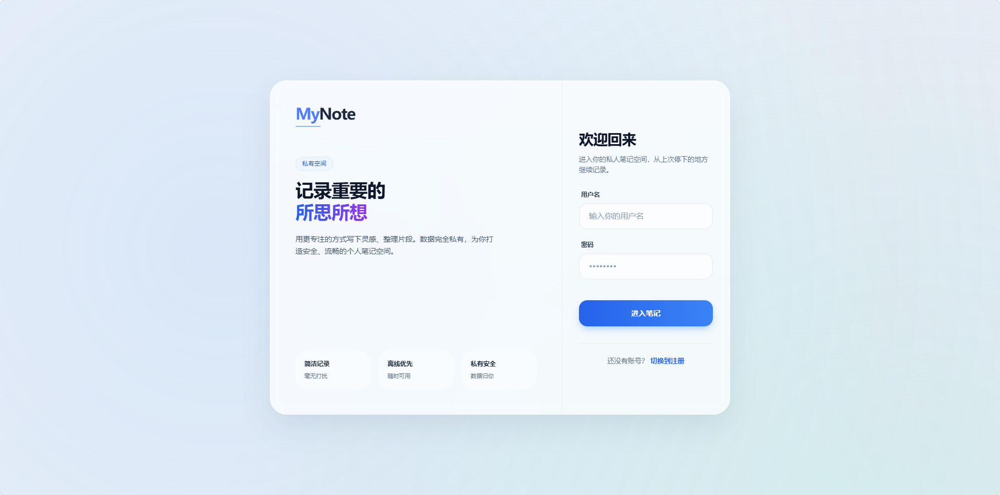
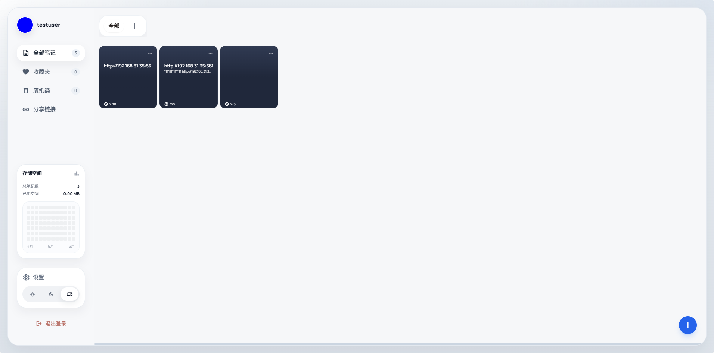
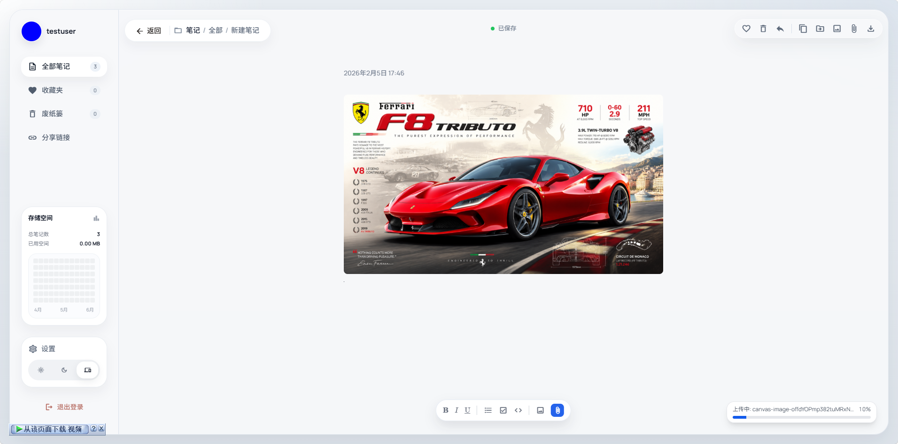
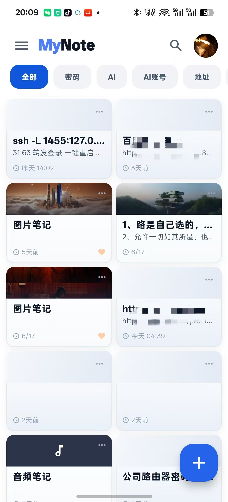
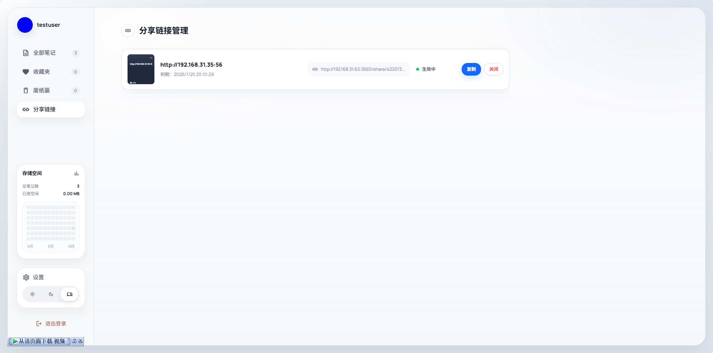

# MyNote

MyNote 是一个面向个人使用的跨端笔记系统，目标是把常用笔记、图片、音频、视频、分享链接和移动端记录放在同一个私有空间里。项目包含 Web 端、NestJS 后端、PostgreSQL 数据库和 Flutter Android 客户端；Docker 部署时只需要暴露一个 `3665` 端口，浏览器页面、API、上传文件访问都从这个端口进入。

## 功能概览

- 笔记管理：新建、编辑、收藏、回收站、分组、置顶和搜索
- 富文本编辑：基础格式、清单、代码块、图片、音频、视频和附件上传
- 分享链接：为笔记生成公开分享链接，并在后台集中管理
- 私有部署：数据保存在自己的 PostgreSQL 与本地上传目录中
- Android 客户端：支持移动端浏览、编辑、媒体插入、离线数据与同步流程
- 单镜像部署：Web 构建产物打包进后端镜像，一个容器同时提供前端页面和 API
- 多架构镜像：GitHub Actions 可发布 `linux/amd64` 和 `linux/arm64` 镜像

## 项目截图

### 登录页



### Web 首页



### Web 编辑器与媒体上传



### Android 首页



### 分享链接管理



## 目录结构

```text
.
├── api/                         # NestJS API 服务
├── web/                         # React + Vite Web 端
├── Android/                     # Flutter Android 客户端
├── screenshots/presentation/    # README 展示截图
├── Dockerfile                   # 生产单镜像构建
├── docker-compose.yml           # 完整 Docker Compose 模板
├── docker-compose.simple.yml    # 极简 Docker Compose 模板
└── .env.example                 # 环境变量示例
```

## Docker 一键部署

推荐使用 Docker Compose 部署。对外只占用一个端口：

- Web 页面：`http://localhost:3665`
- 同一端口下的健康检查：`http://localhost:3665/api/health`
- 上传文件访问：同样走 `http://localhost:3665`

### 方式一：使用完整模板

```bash
git clone https://github.com/Danborad/mynote.git
cd mynote
cp .env.example .env
docker compose up -d
```

启动后打开：

```text
http://localhost:3665
```

完整模板使用根目录 [docker-compose.yml](docker-compose.yml)，适合长期部署，包含健康检查、持久化目录和可配置环境变量。

```yaml
services:
  app:
    image: ${MYNOTE_IMAGE:-zhong12138/mynote:latest}
    container_name: mynote
    ports:
      - "3665:3665"
    environment:
      NODE_ENV: production
      PORT: 3665
      DATABASE_URL: postgresql://mynote:${DB_PASSWORD:-mynote_secret}@db:5432/mynote
      JWT_SECRET: ${JWT_SECRET:-900fd0a5f81ecfcbc6e7bb1ffb251eda4f448626ecf6e9d706bdb2e094ca2500}
      ALLOW_REGISTRATION: ${ALLOW_REGISTRATION:-true}
      ADMIN_USERNAME: ${ADMIN_USERNAME:-admin}
      ADMIN_PASSWORD: ${ADMIN_PASSWORD:-admin123456}
    volumes:
      - ./data/uploads:/app/uploads
      - ./data/backups:/app/backups
    depends_on:
      db:
        condition: service_healthy
    healthcheck:
      test: ["CMD-SHELL", "wget -qO- http://127.0.0.1:3665/api/health >/dev/null 2>&1 || exit 1"]
      interval: 15s
      timeout: 5s
      retries: 5
      start_period: 20s
    restart: unless-stopped

  db:
    image: postgres:15-alpine
    container_name: mynote-db
    environment:
      POSTGRES_USER: mynote
      POSTGRES_PASSWORD: ${DB_PASSWORD:-mynote_secret}
      POSTGRES_DB: mynote
    volumes:
      - ./data/db:/var/lib/postgresql/data
    healthcheck:
      test: ["CMD-SHELL", "pg_isready -U mynote"]
      interval: 5s
      timeout: 5s
      retries: 5
    restart: unless-stopped
```

### 方式二：使用极简模板

如果只想快速跑起来，可以复制下面这份，或直接使用根目录 [docker-compose.simple.yml](docker-compose.simple.yml)。

```bash
docker compose -f docker-compose.simple.yml up -d
```

```yaml
services:
  app:
    image: zhong12138/mynote:latest
    ports:
      - "3665:3665"
    environment:
      PORT: 3665
      DATABASE_URL: postgresql://mynote:mynote_password@db:5432/mynote
      JWT_SECRET: change_this_to_a_long_random_secret
      ALLOW_REGISTRATION: "true"
      ADMIN_USERNAME: admin
      ADMIN_PASSWORD: admin123456
    volumes:
      - ./data/uploads:/app/uploads
      - ./data/backups:/app/backups
    depends_on:
      - db
    restart: unless-stopped

  db:
    image: postgres:15-alpine
    environment:
      POSTGRES_USER: mynote
      POSTGRES_PASSWORD: mynote_password
      POSTGRES_DB: mynote
    volumes:
      - ./data/db:/var/lib/postgresql/data
    restart: unless-stopped
```

上线前建议修改 `JWT_SECRET`、`ADMIN_PASSWORD` 和数据库密码。

## 环境变量

常用变量见 [.env.example](.env.example)：

- `MYNOTE_IMAGE`：默认镜像，通常为 `zhong12138/mynote:latest`
- `DB_PASSWORD`：PostgreSQL 密码
- `JWT_SECRET`：登录 Token 签名密钥，生产环境请改成高强度随机字符串
- `ALLOW_REGISTRATION`：是否允许用户注册
- `ADMIN_USERNAME`：初始化管理员用户名
- `ADMIN_PASSWORD`：初始化管理员密码

## 本地构建

构建单镜像：

```bash
docker build -t mynote:local .
MYNOTE_IMAGE=mynote:local docker compose up -d
```

Web 构建产物会复制到后端镜像的 `/app/public`，生产运行时由 NestJS 同时提供静态页面、API、上传文件和分享页面。

## 本地开发

后端：

```bash
cd api
npm install
npm run start:dev
```

前端：

```bash
cd web
npm install
npx vite
```

开发模式用于改代码调试；正式给用户访问时请使用 Docker 部署，只开放 `3665`。

## Android 客户端

Android 客户端位于 [Android/](Android/)：

- Flutter 实现
- 支持服务器地址配置
- 支持笔记详情页字体大小设置
- 支持图片、音频、视频媒体插入
- 支持离线模式与重新连接后的同步流程

更多说明见 [Android/README.md](Android/README.md)。

## Docker Hub 镜像

镜像名：

```text
zhong12138/mynote
```

支持架构：

```text
linux/amd64
linux/arm64
```

推送到 `main` 分支或发布版本标签后，GitHub Actions 会构建并发布镜像。仓库维护者只需要在 GitHub Actions Secrets 中配置 Docker Hub 登录信息，普通使用者不需要配置这些内容。

## 截图维护

README 只引用 `screenshots/presentation/` 下适合公开展示的图片。过程截图、测试证据、日志和临时文件不作为首页展示内容。

截图目录规则见 [screenshots/README.md](screenshots/README.md)。
