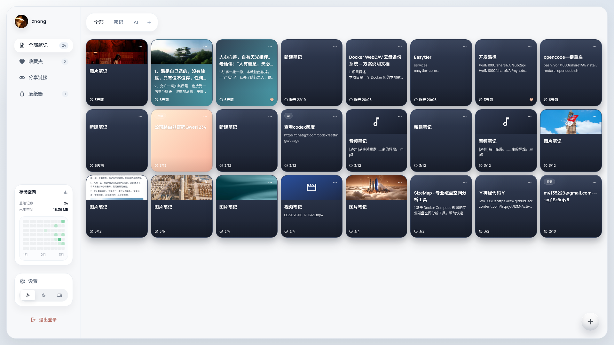
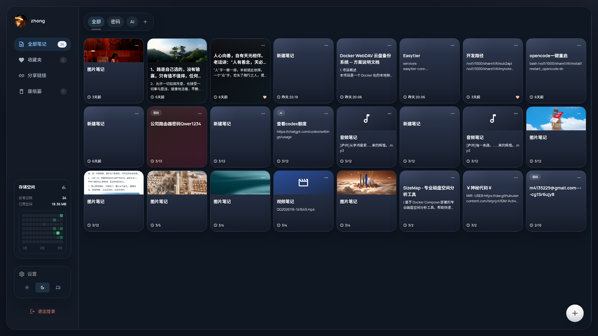
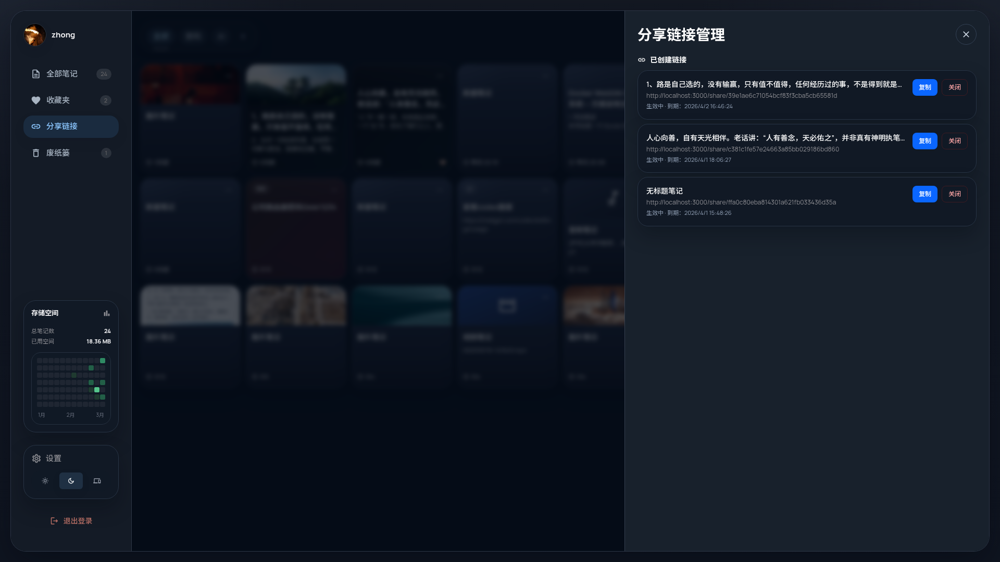
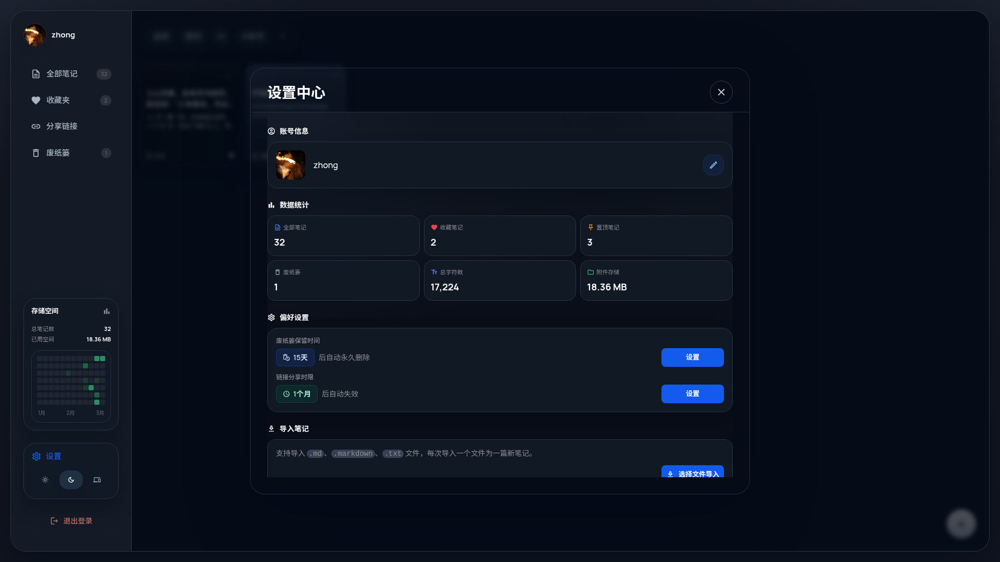
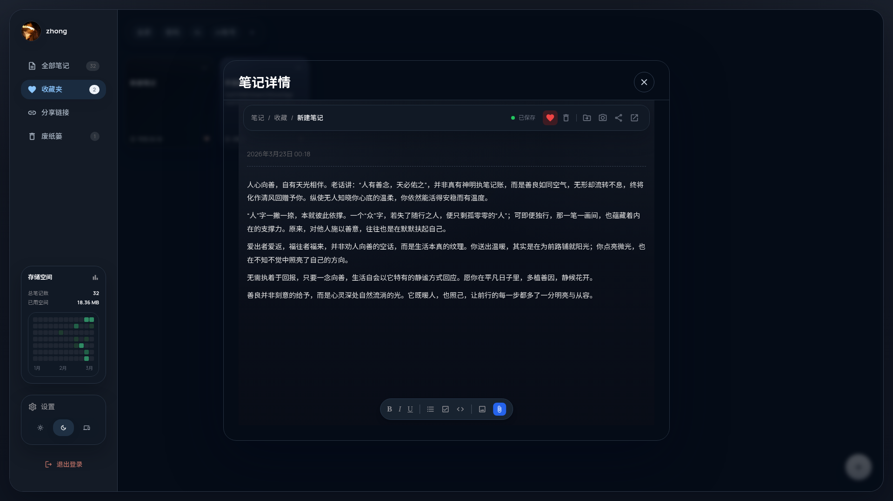

# MyNote

MyNote 是一个跨端笔记项目，包含：

- `web/`：React + Vite Web 端
- `api/`：NestJS + PostgreSQL 后端
- `Android/`：Flutter 原生 Android 客户端

项目支持笔记管理、收藏、回收站、分组、分享链接、媒体附件，以及 Android 端离线/同步能力。

## 项目截图

### 首页（浅色）



### 首页（深色）



### 分享链接



### 设置页



### 编辑器



## 功能特性

- Web 笔记编辑与管理
- NestJS API 与 PostgreSQL 持久化
- 文件上传与媒体附件
- 分享链接页
- 收藏夹、回收站、分组
- Android 原生客户端
- Docker Compose 一键部署
- GitHub Actions 自动构建 Docker Hub 多架构镜像

## 目录结构

```text
.
├── api/                # NestJS backend
├── web/                # React + Vite frontend
├── Android/            # Flutter Android app
├── screenshots/        # 展示图与测试证据
├── docker-compose.yml  # 生产部署模板
└── Dockerfile          # 单镜像生产构建
```

## Docker 快速部署

1. 复制环境变量模板：

```bash
cp .env.example .env
```

2. 按需修改 `.env` 中的密码和密钥。

3. 启动：

```bash
docker compose up -d
```

4. 打开：

- App: `http://localhost:3665`
- Health: `http://localhost:3665/api/health`

默认管理员来自环境变量：

- `ADMIN_USERNAME`
- `ADMIN_PASSWORD`

## Docker Compose 模板说明

根目录 `docker-compose.yml` 默认使用 Docker Hub 镜像：

- `zhong12138/mynote:latest`
- `postgres:15-alpine`

如果本地先构建镜像再启动，可这样运行：

```bash
docker build -t mynote:local .
MYNOTE_IMAGE=mynote:local docker compose up -d
```

## 环境变量

常用变量见 `.env.example`：

- `MYNOTE_IMAGE`
- `DB_PASSWORD`
- `JWT_SECRET`
- `ALLOW_REGISTRATION`
- `ADMIN_USERNAME`
- `ADMIN_PASSWORD`

## 本地开发

### 后端

```bash
cd api
npm install
npm run start:dev
```

### 前端

```bash
cd web
npm install
npx vite
```

默认开发代理：

- Web: `http://localhost:5173`
- API: `http://localhost:3000`

## Android 客户端

Android 原生客户端位于 `Android/` 目录。

详细说明见：

- [Android/README.md](Android/README.md)

## Docker Hub 自动发布

项目计划通过 GitHub Actions 自动推送镜像到 Docker Hub：

- 镜像名：`zhong12138/mynote`
- 架构：`linux/amd64`、`linux/arm64`

GitHub 仓库需要配置 Secrets：

- `DOCKERHUB_USERNAME`
- `DOCKERHUB_TOKEN`

## 截图目录

截图维护规则见：

- [screenshots/README.md](screenshots/README.md)
